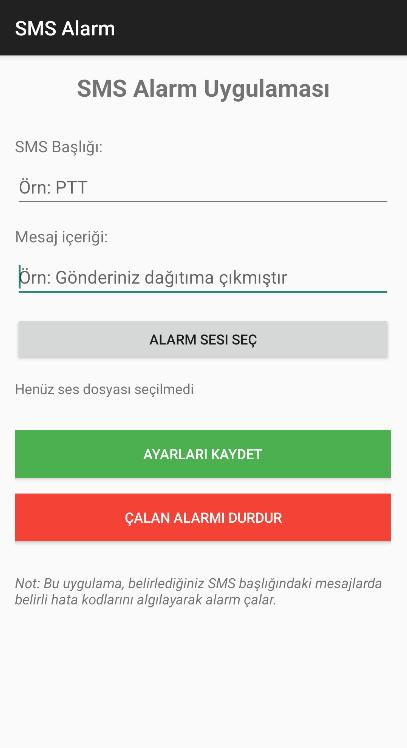
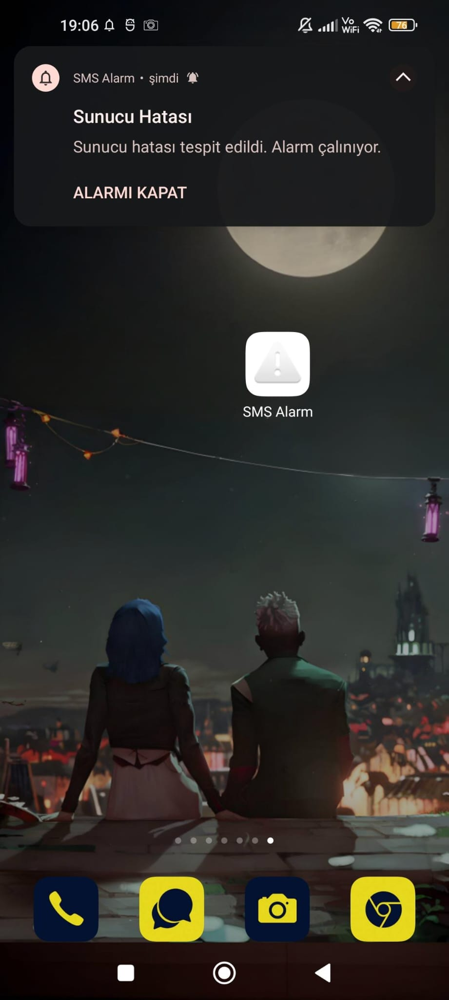

# SMS Alarm Uygulaması

<p align="center">
  SMS ALARM
</p>

## 📱 Genel Bakış

SMS Alarm, özellikle sistem yöneticileri ve sunucu izleme ihtiyaçları olanlar için tasarlanmış bir Android uygulamasıdır. Belirli bir SMS başlığıyla gelen mesajları izler ve içinde belirttiğiniz hata kodunu tespit ettiğinde otomatik olarak alarm çalar.

## 🚀 Temel Özellikler

- **Özelleştirilebilir SMS İzleme**: İstediğiniz SMS başlığını belirleyebilirsiniz
- **Hata Kodu Tespiti**: Belirli bir hata kodunu izleyebilirsiniz
- **Özel Alarm Sesi**: Kendi seçtiğiniz ses dosyasını alarm olarak kullanabilirsiniz
- **Kolay Kapatma**: Alarm çaldığında hem bildirim üzerinden hem de uygulama içinden durdurabilirsiniz
- **Arka Planda Çalışma**: Uygulama arka planda çalışarak sürekli izleme yapar

## 📋 Kullanım Senaryosu

Bu uygulama, sunucu sistemlerinde bir hata oluştuğunda, sunucunun otomatik olarak gönderdiği SMS mesajlarını algılayarak sizi sesli olarak uyarmak için tasarlanmıştır.

**Örnek Senaryo**:
1. Sunucunuz bir sorunla karşılaştığında, otomatik olarak "MAGNUM OTO" başlıklı bir SMS gönderir
2. Bu SMS'in içinde "F001" gibi bir hata kodu bulunur
3. SMS Alarm uygulaması bu mesajı tespit eder ve hemen seçtiğiniz alarm sesini çalar
4. Böylece, telefonunuza bakmıyor olsanız bile, sistem sorunlarından anında haberdar olursunuz

## 🔧 Kurulum ve Ayarlar

> 📱 **APK Dosyası:** Bu repo'da bulunan APK dosyasını indirerek uygulamayı doğrudan kurabilirsiniz!

### Kurulum
1. Uygulamayı şu yollardan biriyle indirin:
   - GitHub repo'sundaki Releases bölümünden APK dosyasını indirin
   - Doğrudan repo'dan `app-release.apk` dosyasını indirin
2. İndirilen APK dosyasını Android cihazınıza kurun (Bilinmeyen kaynaklara izin vermeniz gerekebilir)
3. SMS ve depolama izinlerini verin
4. Uygulamayı açın

### Ayarlar
1. **SMS Başlığı**: İzlemek istediğiniz SMS gönderen başlığını girin (örn. "MAGNUM OTO")
2. **Hata Kodu**: Tespit edilecek hata kodunu girin (örn. "F001")
3. **Alarm Sesi**: "Alarm Sesi Seç" butonuna tıklayarak telefonunuzdan bir ses dosyası seçin
4. **Kaydet**: "Ayarları Kaydet" butonuna tıklayarak tercihleri kaydedin

## 📷 Ekran Görüntüleri

<p align="center">
  
  
</p>
## ⚙️ Teknik Detaylar

- Min SDK Version: 21 (Android 5.0 Lollipop)
- Target SDK Version: 33 (Android 13)
- Java programlama dili kullanılarak geliştirilmiştir
- BroadcastReceiver ile SMS'leri dinler
- Foreground Service kullanarak arka planda alarm çalar

## 💡 Özelleştirme İpuçları

- **Ses Seçimi**: Alarm sesi olarak dikkat çekici, yüksek ses seviyeli bir dosya seçmeniz önerilir
- **Birden Fazla Kod**: Farklı hata kodları için birden fazla kopya kurabilir, her birini farklı seslerle eşleştirebilirsiniz
- **Pil Tasarrufu**: Bazı telefonlarda, uygulamanın arka planda düzgün çalışması için pil optimizasyonlarını kapatmanız gerekebilir

## 🔄 Sorun Giderme

- **SMS Algılanmıyor**: Telefonunuzun SMS izinlerini kontrol edin ve uygulamayı pil optimizasyonlarından muaf tutun
- **Ses Çalmıyor**: Ses dosyasının doğru seçildiğinden ve telefonunuzun sesinin açık olduğundan emin olun
- **Uygulama Kapanıyor**: Android sürümünüzün güncel olduğundan emin olun

## 🛠️ Geliştirme ve Katkıda Bulunma

Bu uygulama açık kaynak kodludur. Kodu inceleyin, geliştirmeler yapın ve pull request gönderin!

```bash
# Projeyi klonlayın
git clone https://github.com/kullaniciadi/SMS-Alarm-App.git

# Android Studio ile açın
cd SMS-Alarm-App
```

## 📜 Lisans

Bu proje MIT lisansı altında lisanslanmıştır. Daha fazla bilgi için `LICENSE` dosyasına bakın.


---

<p align="center">
  Geliştirici tarafından ❤️ ile yapıldı
</p>
